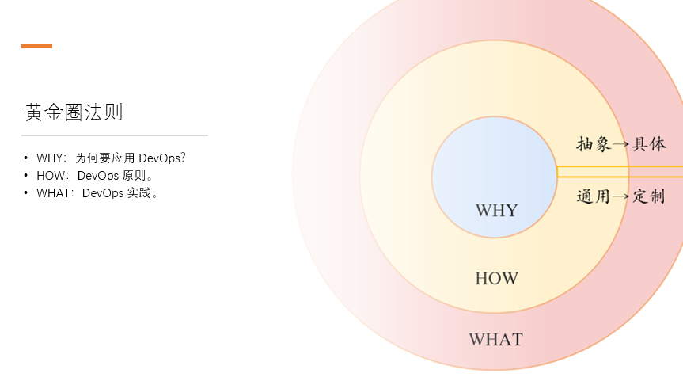
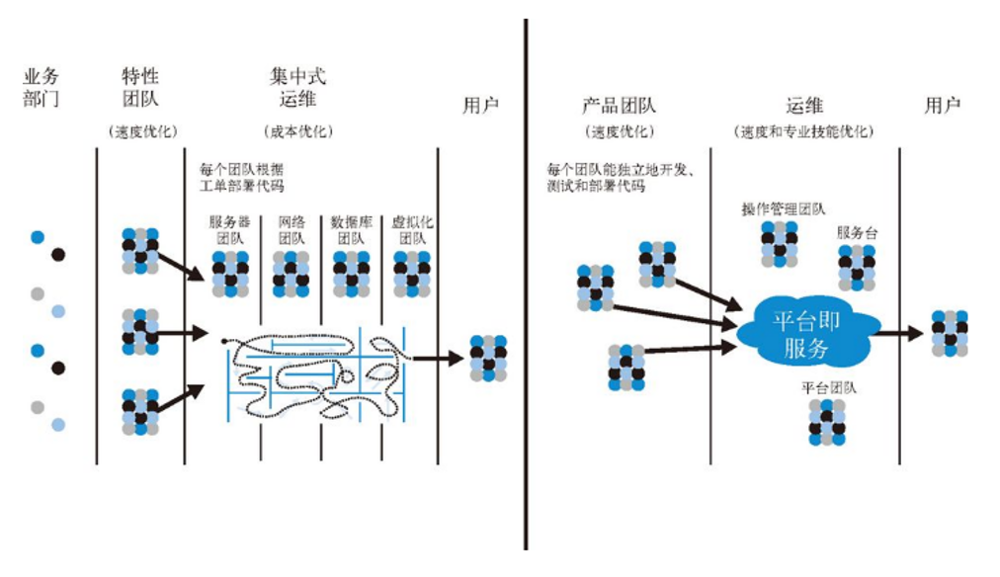

# 万字长文带你彻底搞懂什么是 DevOps

DevOps 日渐成为研发人员耳熟能详的一个组合词，但什么是 DevOps，为什么 DevOps 对于互联网企业如此重要，真正将其思考透彻的人却不多，带着这些困惑，本文将带你一探 DevOps 的起源、原则和实践，让你搞清楚到底何为 DevOps。

DevOps 的起源可以追溯到 2008 年，在一次敏捷大会的敏捷基础设施话题组被提及，从起源我们可以了解到 DevOps 的发展跟敏捷软件开发是密不可分的。

## DevOps 定义

DevOps 经过这些年的发展，其定义也在不断变化，先来看三段 DevOps 的 wiki 定义。

1. DevOps 2017 - 2020 年英文 wiki 定义（直译）
    > DevOps是一种**软件工程文化和实践（Practices）**，旨在整合软件开发和软件运维。DevOps运动的主要特点是强烈倡导对构建软件的所有环节（从集成、测试、发布到部署和基础架构管理）进行全面的自动化和监控 DevOps 的目标是缩短开发周期，提高部署频率和更可靠地发布，与业务目标保持一致。

2. DevOps 2021 年英文 wiki 定义（直译）
   > DevOps 是一系列整合软件开发和软件运维活动的**实践（Practices）**。目标是缩短软件开发生命周期并使用持续交付提供高质量的软件。

   另：

   > DevOps 与敏捷软件开发是互补关系，DevOps 的许多方面来自于敏捷方法论。

3. DevOps 中文 wiki 定义
   > DevOps（Development和Operations的组合词）是一种重视“软件开发人员（Dev）”和“IT运维技术人员（Ops）”之间**沟通合作**的文化、运动或惯例。透过自动化“软件交付”和“架构变更”的流程，来使得构建、测试、发布软件能够更加地快捷、频繁和可靠。

提取这三段的共同点，可以看到不论定义如何变化，DevOps 所要实现的目标都是一致的——缩短软件开发生命周期并使用 **持续交付** 提供高质量的软件。由于持续交付活动中包含了构建、测试和发布等活动，我更倾向于用这个定义，可以更好地缩减定义长度。

另外可以看到英文直接翻译过来的定义中都包含「**实践**」 一词，而中文 wiki 经过一定的翻译或本地化后变成了「**文化、运动或惯例**」，其还更强调开发运维之间 **沟通合作** 这一点，因此将最新的英文 wiki 定义与中文 wiki 定义相结合，可以帮助我们更好地理解 DevOps，那么它的最终定义是什么就交由读者朋友自己去领会吧。

## DevOps 发展背景

为什么 DevOps 会如此热门，时常被人所提及，这与其发展背景是分不开的，主要原因可以概括为以下几点：

1. 敏态需求的增加，即探索性工作的增加；

   - 软件开发从传统的瀑布流方式到敏捷开发，再到现在对敏捷开发提出了更高的要求，近些年创新型的应用不断涌现，在这些应用的研发过程中多采用小步快跑、快速试错的方式，这些探索性工作要求运维能够具备一天发布多次的能力，需要企业完成由稳态到敏态的转变。

2. 软件开发活动在企业经营活动中占比的不断增加；

    - 业务发展对软件的依赖由轻度依赖、中度依赖发展到目前的重度依赖。

3. 企业存在对消除浪费的需求。

    - 软件开发活动在企业中的位置越来越重要，而像企业经营活动一样，软件开发活动中也存在着许多的浪费，企业管理上必然存在着 **识别并消除浪费** 的需求。
    - 软件开发中的浪费包括不必要和必要的浪费，不必要的浪费有：无人使用的功能、软件bug、等待测试、等待审批等；必要的浪费包括：工作项移交、测试、项目管理等。

以上主要从企业的角度说明了 DevOps 的发展，这是较为深层次的原因，表层的推动因素包括：容器化技术的发展、微服务架构的发展等等，这些技术上的创新为 DevOps 提供了良好的发展条件，以解决企业面临的这些问题。

## DevOps 原则与实践

了解了什么是 DevOps 及其发展原因后，又该如何具体的进行 DevOps 实践，我们采用黄金圈法则来思考这一问题。

DevOps 原则是总体指导思想，实践是具体的执行方法，DevOps 是一个动态的过程，在进行相关实践的时候可以看看其应用了哪些原则，当违背原则的时候需要思考实践的合理性。

## DevOps 原则

DevOps 包含以下三大原则：

1. 流动原则：**加速** 从开发、运维到交付给客户的流程；
2. 反馈原则：建设 **安全可靠** 的工作体系；
3. 持续学习与实验原则：采用科学的工作方式，将对组织的 **改进和创新** 作为工作的一部分。

### 流动原则

1. 坚持少做
    - 产品开始开发时采用 MVP 原则。
    - 产品迭代时要适时做减法。

2. 持续分解问题
   - 大的变更或需求拆解为一系列小的变更，快速解决。

3. 工作可视化
   - 采用 Sprint 看板将工作可视化。

4. 控制任务数量
   - 减少前置时间，降低测试人员的等待时间。
   - 任务越多，预估越不准确。

5. 减少交接次数
   - 减少不必要的沟通和等待。

6. 持续识别和改善约束点
   - 识别出影响流动的主要前置因素，比如搭建环境、需求文档。
   - QA、开发、运维、产品持续提升生产力。
   - 为非功能性需求预留20%的开发时间，减少技术债务。

7. 消除价值流中的困境和浪费（导致交付延迟的主要因素）
   - 半成品——未完全完成的工作。
   - 额外工序——从不使用的文档、重复编写接口文档等。
   - 额外功能——用户实际不需要的功能。
   - 任务切换——将人员分配到多个项目或截然不同的工作任务中。
   - 等待、移动、缺陷、非标准化的手动操作。

### 反馈原则

1. 在复杂系统中安全地工作
   - 管理复杂的工作，识别出设计和操作的问题；
   - 群策群力解决问题，从而快速构建新知识；
   - 在整个组织中，将区域性的知识应用到全局范围；
   - 领导者要持续培养有以上才能的人。

2. 及时发现问题
    - 快速、频繁和高质量的信息流——每个工序的操作都会被度量和监控。
    - 技术价值流的每个阶段（产品管理、开发、QA、安全、运维），建立快速的反馈和前馈回路（包括自动化构建、集成和测试过程）。
    - 全方位的遥测系统。

3. 在源头保障质量
   - 过多的检查和审批流程，使得做决策的地方远离执行工作的地方，这导致流程有效性降低，减弱了因果关系之间反馈的强度。
   - 让开发人员也对系统质量负责，快速反馈，加速开发人员的学习。

4. 为内部客户优化工作
    - 运维的非功能性需求（如架构、性能、稳定性、可测试性、可配置性和安全性）与用户功能同样重要。

### 持续学习与实验原则

1. 建立学习型组织和安全文化
2. 将日常工作的改进制度化
3. 把局部发现转化为全局优化
4. 在日常工作中注入弹性模式
    - 缩短部署的前置时间、提高测试覆盖率、缩短测试执行时间，甚至在必要时解耦架构，都属于在系统中引入类似张力的做法。
5. 领导层强化学习文化
    - 领导者帮助一线工作者在日常工作中发现并解决问题。

## DevOps 实践

基于 DevOps 的相关原则，有与其对应的实践，包括：流动的技术实践、反馈的技术实践和持续学习与实验的技术实践。在应用这些实践之前还需认真设计组织结构，使其有利于实践的开展。

### 设计组织结构

- 利用康威定律设计团队结构。
  - 康威定律：软件的架构和软件团队的结构是一致的。
  - 软件的架构应该保证小团队能够独立运作，彼此充分解耦，从而避免过多不必要的沟通和协调。
- 过度职能导向（成本优化）的危害。
  - 执行工作的人通常不理解自己的工作与价值流目标的关系（“我之所以要配置这台服务器，是因为别人要我这么做”）。
  - 如果运维部门的每个职能团队都要同时服务于多个价值流（即多个开发团队），那么问题更是雪上加霜，因为所有团队的时间都很宝贵。
- 组建以市场为导向的团队。
  - 将工程师及其专业技能（例如运维、QA和信息安全）嵌入每个服务团队，或者向团队提供自助服务平台，其功能包括配置类生产环境、执行自动化测试或进行部署。
  - 这使每个服务团队能够独立地向客户交付价值，而不必提交工单给IT运维、QA或信息安全等其他部门。
- 使职能导向有效。
  - 快速响应。
  - 高度信任的文化。
- 将测试、运维和信息安全融入日常工作。
  - 保证质量、可用性和安全性不是某个部门的职责，而是所有人日常工作的一部分。
- 使团队成员成为通才。
  - 培养全栈工程师。
  - 给工程师提供学习必要技能的机会，让他们有能力构建和运行所负责的系统。
- 松耦合架构，提高生产力和安全性。
- 保持小规模（“两个披萨原则”）。

要使职能导向有效，需要由传统的集中式运维向提供运维服务的方向转变。

### 运维融入项目开发工作

- 创建共享服务（类生产环境、部署流水线、自动化测试工具、生产环境监控台、运维服务平台等），提高开发生产力。
- 运维工程师融入开发团队。
  - 使产品团队自给自足，可以完全负责服务的交付和支持。
  - 派遣工程师到项目开发团队（运维工程师的面试和聘用仍由集中式运维团队完成）。
- 为每个项目团队分派运维联络人（派遣的运维工程师）。
  - 集中式运维团队管理所有环境，派遣的运维工程师需要理解：新产品的功能、开发原因、程序如何工作、可运维性、可扩展性、监控能力、架构模式、对基础设施的要求、产品特性的发布计划等。
- 邀请运维联络人参加开发团队会议、每日站会、回顾会议。
- 使用看板图展示运维工作。

### 流动的技术实践

该部分包含以下内容：

- 运行部署流水线的基础。
- 实现快速可靠的自动化测试。
- 代码持续集成。
- 自动化和低风险发布。
- 降低发布风险的架构。

#### 运行部署流水线的基础

- 自动化环境（开发、测试、正式）搭建。
  - 使用 Shell、IaC（Puppet、Ansible、Terraform）、Docker、K8S、OpenShift 等技术。
- 所有内容做版本控制。
  - 应用程序代码版本控制；
  - 数据库代码版本控制；
  - 运维配置代码版本控制；
  - 自动化和手动测试的脚本；
  - 支持代码打包、部署、数据库迁移、应用配置的脚本；
  - 项目相关文件（需求文档、部署过程、发布说明等）；
  - 防火墙配置、服务器配置等脚本。
- 扩展完成的定义。
  - 在类生产环境中按照预期进行，开发工作才认为是完成的。

#### 实现快速可靠的自动化测试

- 持续构建、测试和集成。
  - 代码分支持续集成到主干中，并确保通过单元测试、集成测试和验收测试。
  - 常用工具：Jenkins、TFS、TeamCity、GitLab CI。
  - 对持续集成的配合：自动化测试工具；一旦失败必须立即解决的文化；代码持续合入到主干，而不是持续在特性分支上工作。
- 构建快速可靠的自动化测试套件。
  - 单元测试：JUnit、Mockito、PowerMock
  - 单元测试度量：测试覆盖率。
  - 验收测试：自动化API测试、自动化GUI测试。
  - 并行测试：安全测试、性能测试、单元测试、自动化测试。
  - 测试驱动开发：TDD、ATDD。
- 让部署流水线始终保持绿色状态。
  - 部署流水线失败时，所有人立即解决问题或者立即回滚代码，后续的代码提交应该拒绝。

#### 代码持续集成

- 持续集成代码。
  - 开发人员在自己的分支上独立工作的时间越长，就越难将变更合入主干。
- 小批量开发。
- 基于主干开发。
  - 频繁向主干提交（通过合并请求）代码。

#### 自动化和低风险发布

- 自动化部署步骤：构建、测试、部署；相关流程包括：
  - 代码打包、构建；
  - 上传 Docker 镜像；
  - 创建预配置的 K8S 服务；
  - 自动化单元测试、冒烟测试；
  - 数据库迁移自动化；
  - 配置自动化。
- 应用自动化的自助式部署
  - 开发人员专注于编写代码，点击部署按钮，通过监控指标看到代码在生产环境中正常运行，在代码出错时能获得错误信息快速修复。
  - 通过代码审查、自动化测试、自动化部署，控制部署风险，必要时使开发人员也可进行部署操作，测试人员和项目经理可在某些环境中进行部署。
- 将部署和发布解耦
  - 部署指在特定环境中安装制定版本的软件。
  - 发布指将产品特性提供给所有客户或部分客户使用。
- 基于环境的发布模式
  - 蓝绿部署
  - 灰度（金丝雀）发布
- 基于应用的发布模式
  - 实现特性开关，好处：轻松地回滚、缓解性能压力、可以屏蔽服务依赖。
  - 实现黑启动：发布潜在风险的新特性时，隐式调用，仅记录测试结果。
- 持续交付的实践
  - 持续交付是指，所有开发人员都在主干上进行小批量工作，或者在短时间存在的特性分支上工作，并且定期向主干合并，同时始终让主干保持可发布状态，并能做到在正常的工作时段里按需进行一键式发布。开发人员在引入任何回归错误时（包括缺陷、性能问题、安全问题、可用性问题等），都能快速得到反馈。一旦发现这类问题，就立即加以解决，从而保持主干始终处于可部署状态。
- 持续部署的实践
  - 持续部署是指，在持续交付的基础上，由开发人员或运维人员自助式地定期向生产环境部署优质的构建版本，这通常意味着每天每人至少做一次生产环境部署，甚至每当开发人员提交代码变更时，就触发一次自动化部署。
- 大多数团队采用持续交付实践。

#### 降低发布风险的架构

- 松耦合架构
- 面向服务的架构
- 安全地演进企业架构
  - 绞杀者应用模式：API封装已有功能、按新架构实现新功能、API版本化。
- 云原生架构

### 反馈的技术实践

这部分包含以下内容：

- 建立遥测系统
- 智能告警
- 应用反馈实现安全部署
- 应用A/B测试
- 建立评审和协作流程

#### 建立遥测系统

- 什么是遥测（Telemetry）？
  - 遥测包含监控，实现对网络实时、高速和更精细的监控技术。
  - 相比于传统的网络监控技术，遥测通过推模式，主动向采集器上推送数据信息，提供更实时更高速更精确的网络监控功能。
- 遥测的三大维度
  - Tracing（跟踪），Metrics（指标） , Logging（日志）。
- 可观察性
  - 系统可以由其外部输出（遥测的数据）推断其内部状态的程度。
  - 能发现、预测并解决问题。
- 集中式监控系统（可使用：Prometheus、SkyWalking）
  - 在业务逻辑、应用程序和环境层收集数据。
  - 负责存储和转发事件和指标的事件路由器。
- 应用程序日志遥测（ELK、审计日志、Metrics）
- 重大应用事件清单：
  - 认证/授权的结果（包括退出）；
  - 系统和数据的访问；
  - 系统和应用程序的变更（特别是特权变更）；
  - 数据的变更，例如增加、修改或删除数据；
  - 无效输入（可能的恶意注入、威胁等）；
  - 资源（内存、磁盘、中央处理器、带宽或其他任何具有硬/软限制的资源）；
  - 健康度和可用性；
  - 启动和关闭；
  - 故障和错误；
  - 断路器跳闸；
  - 延迟；
  - 备份成功/失败。
- 将建立生产遥测融入日常开发工作。
- 使用遥测指导问题的解决。
- 建立自助访问的可视化遥测信息系统（信息辐射器）
  - Grafana
  - SkyWalking
  - Kibana
- 发现和填补遥测的盲区（建立充分而完整的遥测）
  - 业务级别：订单量、用户数、流失率、广告展示和点击等。
  - 应用程序级别：事务处理事件、应用程序故障等。
  - 基础架构级别：服务器吞吐量、CPU负载、磁盘使用率等。
  - 客户端软件级别：应用出错和崩溃、客户端的事务处理事件等。
  - 部署流水线级别：流水线状态、部署频率等。

#### 智能告警

- 解决告警疲劳
  - 充分而完整的遥测会引入告警疲劳问题，需要更智能的报警。
- 使用统计分析方法，而非静态阈值设置告警
  - 使用均值和标准差（适用于正态分布的数据）：度量数据与均值存在较大标准差时告警。
- 使用预防故障的告警，而不只是故障发生后的告警
  - 试着问有什么指标可以预测故障。
- 异常检测技术
  - 平滑统计技术：使用移动平均数，利用每个点与滑动窗口中所有其他数据的平均值，来转换数据。
  - 支持高级异常检测的工具：Prometheus、Grafana。

#### 应用反馈实现安全部署

- 通过遥测使部署更安全——部署后能立即发现问题。
- 价值流中的所有人（开发人员、开发经理、架构师、运维团队等）共同承担运维事故的下游责任。
  - 共同承担值班工作、共同解决生产环境问题。
- 让开发人员跟踪工作对运维人员的影响。
  - 使开发的应用易于部署，提升运维人员幸福感。
- 让开发团队自行管理生产服务。
  - 首先由开发团队管理，然后才交由集中的运维团队管理。
  - 运维工程师由生产支持转变为顾问或加入团队，帮助做好部署准备，建立服务发布指南（包括：支持有效的监控、部署可靠、架构能支持快速频繁的部署等）。
  - 为团队分配SRE人员。SRE定位：SRE就是软件开发工程师负责了运维工作，SRE非常稀少，只能分配给最重要的团队。

#### 应用A/B测试

- 在功能中集成A/B测试
  - 向用户随机展示一个页面的两个版本之一。
- 在发布中集成A/B测试
  - 使用特性开关。
- 在功能规划中集成A/B测试
  - 不仅要快速部署和发布软件，还要在实验方面不断提升，通过实验主动实现业务目标和客户满意度。

#### 建立评审和协作流程

- 防止「过度控制变更」
  - 反事实思维容易认为事故是由于缺乏审批流程导致。
- 建立同行评审，缩短审批流程
  - DevOps 中高绩效的组织更多地依赖同行评审，更少地依赖外部变更批准（层层审批）。
- 代码评审
  - 每个人的代码提交到主干时，必须由同行进行评审；
  - 每个人应该持续关注其他成员的提交活动；
  - 定义高风险变更，从而决定是否需要请领域专家进行审查；
  - 将大的提交变更拆分成小批量变更。
- 利用结对编程改进代码变更
  - 研究表明：结对的程序员比两个独立工作的程序员慢了15%，而‘无错误’代码量却从70%增加到了85%。
  - 测试和调试程序的成本通常比写初始代码的成本高出多倍。
- 评估合并请求的有效性
  - 与在生产环境产生的结果无关。
  - 有效合并请求的基本要素：必须足够详细地说明变更的原因、如何做的变更，以及任何已识别的风险和应对措施。

### 持续学习与实验的技术实践

这部分包含以下内容：

- 将学习融入日常工作
- 将局部经验转化为全局改进
- 预留组织学习和改进的时间

#### 将学习融入日常工作

- 公正文化和学习文化
  - 人为错误往往不是问题的根本原因，可能是复杂系统中存在不可避免的设计问题而导致。
  - 不应该对造成故障的人进行「点名、责备和羞辱」，我们的目标是最大限度地抓住组织学习的机会。
  - 从学习的角度看待错误、报错、失误、过失等。
  - 相关实践1：在事后分析中，不指责，公正地进行评判，使工程师自己愿意对事情负责，并且热情地帮助其他人避免同样的错误发生；广泛地公开事后分析会议结果。
  - 相关实践2：在生产环境中引入受控的人为故障（捣乱猴），针对不可避免的问题进行演练。
- 降低事故容忍度，寻找更弱的故障信号
  - 随着组织能力的提升，事故数量大幅降低，故障越不应该出现。
  - 在复杂的系统中，放大微弱的故障信号对于防范灾难性故障事关重要。
- 重新定义失败
  - 高效能DevOps组织的变更频率是平均水平的30倍，即使失败率只有平均水平的一半，也显然意味着故障总数更多。
  - 鼓励创新并接受因此带来的风险。
- 创建故障演练日
  - 帮助团队模拟和演练事故，使其具备实战能力。
  - 暴露系统的潜在缺陷。

#### 将局部经验转化为全局改进

- [ChatOps] 使用聊天机器人、积累组织知识
  - 自动化工具集成到聊天中，比如（@bot depoy owl to production）；
  - 操作结果由机器人发送回聊天室，每个人都能看到发生的一切；
  - 新来的工程师也可以看到团队的日常工作及执行方式；
  - 看到他人互相帮助时，人们也会倾向于寻求帮助；
  - 使用话题组，建立起组织学习，知识得到快速积累。
  - 加强了透明、协作的文化。
- 将标准、流程和规范转化为便于执行的形式
  - [ArchOps] 使工程师成为构建者，而不是砌砖工；
  - 将手动操作流程转换为可自动化执行的代码；
  - 将合规性使用代码表达出来。
- 运用自动化测试记录和传播知识
  - 自动化界面测试，令使用者知道系统如何使用；
  - 单元测试，令调用者知道方法API如何使用。
- 项目开发中包含非功能性的运维需求
  - 对各种应用和环境进行充分的遥测；
  - 准确跟踪依赖关系的能力；
  - 具有弹性并能正常降级的服务；
  - 各版本之间具有向前和向后的兼容性；
  - 归档数据来管理生产数据集的能力；
  - 轻松搜索和理解各种服务日志信息的能力；
  - 通过多个服务跟踪用户请求的能力；
  - 使用功能开关或其他方法实现简便、集中式的运行时配置。
- 把可重用的运维用户故事纳入开发
  - 将重复的运维工作通过编码进行实现。
- 技术选型需要考虑运维因素
  - 不能减慢工作流；
  - 思考举例：TIDB VS MySQL 该如何选择。

#### 预留组织学习和改进的时间

- 偿还技术债务制度化
  - 定时「大扫除」
  - 开发和运维针对非功能性需求进行优化，横跨整个价值流。
  - 价值：赋予一线工作人员不断识别和解决问题的能力。
- 让所有人教学相长
  - 所有的工程师都越来越需要某些技能，而不只是开发人员如此。
  - 越来越多的技术价值流采用了DevOps的原则和模式。
  - [每周学习文化] 每周一次的学习时间，每个同伴既要自己学习，又要教别人。
- 内部顾问和教练
  - 成立内部的教练和咨询组织，促进专业知识在组织内的传播。

## 实践重点

DevOps 的实践包含许多内容，提炼了以下重点方便查阅：

- 流动原则的实践
  - 部署流水线的基础（所有内容做版本控制、在类生产环境按预期工作才算完成）
  - 实现快速可靠的自动化测试（自动化运行、始终保持流水线处于绿色状态）
  - 代码持续集成（小批量开发）
  - 自动化和低风险发布（自助式部署、部署和发布解耦、采用持续交付）
  - 降低发布风险的架构（云原生架构）
- 反馈原则的实践
  - 建立遥测系统（Tracing、Metrics、Logging）
  - 智能告警（使用统计分析方法和预防故障的告警）
  - 应用反馈实现安全部署（部署后立即发现问题、共同承担责任）
  - 应用A/B测试（功能规划中集成A/B测试、使用特性开关）
  - 建立评审和协作流程（同行评审、减少审批流程、结对编程）
- 持续学习与实验原则的实践
  - 将学习融入日常工作（从学习的角度看待事故、寻找更弱的故障信号）
  - 将局部经验转化为全局改进（ChatOps、让规范便于执行、非功能性的运维需求）
  - 预留组织学习和改进的时间（定时偿还技术债务、教学相长、内部教练）

## 结语

DevOps 的发展与技术的发展相辅相成，也为技术人员提供了更多的学习道路和发展方向，借用一句 DevOps 领袖的话来作为本文的结束语。

> 对于所有热爱创新、热爱变革的专业技术人士来说，我们的前方是美好而充满活力的未来。
