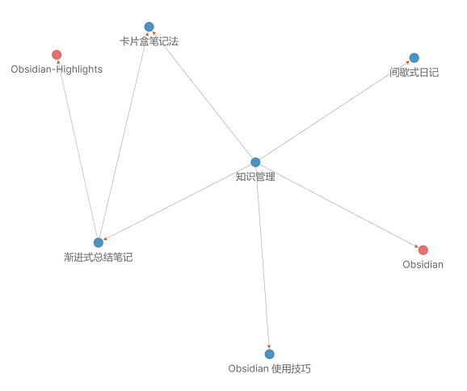
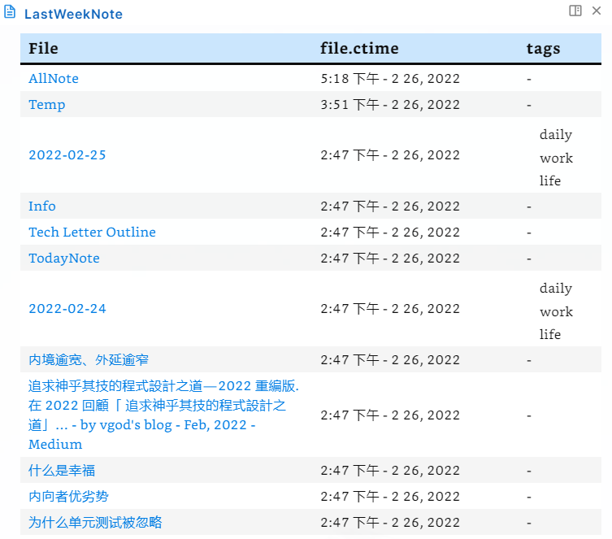

# 008 📚 Notion vs Obsidian、程序设计 vs 软件工程

欢迎打开第 008 期「野生架构师」周刊，这是由  [lcomplete](https://twitter.com/lcomplete_wild) 每周发送的 newsletter，本周的主题是相似工具和事物间的对比，通过搞清楚差异可以让我们更好地运用它们。

## Notion vs Obsidian

以防有不了解 Notion 的读者朋友，我们先看看其 wiki 介绍：

> Notion 是一款提供笔记、任务、数据库、看板、维基、日历和提醒等组件的应用程序。用户可以将这些 **组件连接起来，来创建自己的系统** ，用于知识管理、笔记记录、数据管理、项目管理等。这些组件和系统可以单独使用，也可以与他人进行 **跨平台协作**。

Notion 很强大，是一个 All In One 的笔记工具，除了 wiki 里提到的功能，用它还可以玩出很多花样，比如：

- 搭建内容管理系统：[Using the Notion API to Build a Content Management System](https://www.appsmith.com/blog/using-the-notion-api-to-build-a-content-management-system) ；
- 用 Notion 谈恋爱：[七夕特供 | 如何用 Notion 谈恋爱](https://sspai.com/post/65098) ；
- 用 Notion 组织推文：[Twitter Scheduling Tool for Notion](https://www.queue.so/) 。

为什么 Notion 这么强大，本质上在于它给我们提供了一个易用的 `数据库` ，数据库可以用表格、看板、列表、日历、画廊和时间线的方式来组织或展示。当我们在 Notion 中新建内容时，首先要考虑它的组织方式，如果你有很好的内容组织能力，就越能将其使用的得心应手，甚至制作模板进行售卖，或者分享使用心得，比如这位作者则分享了他是如何使用 Notion 来学习编程的：[Using Notion to organise programming topics](https://blog.damiandemasi.com/using-notion-to-organise-programming-topics) 。

在 Notion 中记笔记的路径是 `从数据库到文档` ，而 Obsidian 在记笔记的路径上则与其相反，使用它我们不需要先考虑数据结构，而是直接记录笔记，然后再通过笔记的元数据来得到数据库，这就形成了 `从文档到数据库` 。二者都具备文档和数据库的闭环，但他们的使用思想却截然不同，这就是为什么我要拿 Notion 和 Obsidian 进行比较，通过这一点我们可以很清楚地看出两者的优劣，更能搞清楚哪种情况下用哪种工具。

### Obsidian + 卡片盒笔记法

Obsidian 是借鉴卡片盒笔记法进行设计的，而卡片盒笔记有三个重要特点：

- 原子化：每条笔记包含且只包含一条知识，每个笔记都具有一个唯一标志，在 Obsidian 中这个标志是文件名。
- 个性化：每个笔记尽管可能包含收集、整理、标注、概括阶段的内容，但也一定要用自己的语言去描述这个知识点，只有经过自己的描述，才真正融入自己的思想。
- 连接性：笔记之间通过唯一标志可以互相连接，从而形成个人的思想之网。

思想之网局部图（示例）：

更详细的介绍可以查看：[卢曼卡片盒笔记法介绍 (Introduction to the Zettelkasten Method)](https://zettelkasten.de/introduction/zh/)

如果上面的概念一时难以吸收的话，可以将卡片盒笔记类比成 `个人的维基百科` ，它们之间有许多相似之处，只不过卡片盒中的每个百科主题都是更小的知识点，用好卡片盒笔记法就是在脑子里装进一个自己的维基百科，现在你明白为什么 Obsidian 的口号是帮你构建第二大脑了吗？

借助 Dataview 插件，可以从数据视图来查阅笔记，**把整个笔记本当作一个数据库来使用** ，可根据需求来定制数据，比如写这篇 newsletter 时我可以查询笔记数据库中最近一周创建的笔记来决定写哪些内容。

Dataview 使用类似 SQL 的 DSL 语法，对于非程序员来说上手会稍难，感兴趣的可以查看：[如何在 Obsidian 中自動彙整筆記？使用 Dataview 查詢與呈現符合條件的筆記](https://medium.com/pm%E7%9A%84%E7%94%9F%E7%94%A2%E5%8A%9B%E5%B7%A5%E5%85%B7%E7%AE%B1/obsidian-%E4%BD%BF%E7%94%A8%E6%95%99%E5%AD%B8-%E6%8F%92%E4%BB%B6%E7%AF%87-02-%E5%A6%82%E4%BD%95%E5%9C%A8-obsidian-%E4%B8%AD%E8%87%AA%E5%8B%95-%E5%BD%99%E6%95%B4%E7%AD%86%E8%A8%98-8d90b5e44f6a) 。

Notion 和 Obsidian 都是现在非常受欢迎的笔记系统，值得我们去学习，当然学习后更重要的是持续使用它们。

## 程序设计 vs 软件工程

[vgod](https://blog.vgod.tw/) 是台湾人，在 MIT 读的计算机专业，自从他读完博士以后就很少写博客了，即便如此，我还是经常分享他写过的 `「追求神乎其技的程式設計之道」` 系列文章，这系列文章启发了很多台湾的软件工程师，因为网络的关系也被我发现了，其中的许多观点我都非常喜欢。

比如：

> 很多人都聽說過，同樣是寫程式，一個頂尖程式設計師和一個普通程式設計師之間的生產力可以有 **十倍甚至百倍的差距** 。這是其他行業很少見到的現象，於是不禁令人納悶，為什麼會這樣呢？
>
> ...
>
> 我後來發現，程式設計師和其他行業有個很大的不同點：一般行業只能在現有的工具上磨練自身的技術，但 `程式設計師除了磨練技術外，還可以獨自創造、修改自己使用的工具；換句話說，程式設計師的能力就是在電腦上創作出更好的軟體，不但能便利他人，也同時能增進自身使用電腦的工作效率` 。舉例來說，理髮師能磨練使用剪刀和設計髮型的技術，但理髮師並不知道怎麼發明及製造新的剪刀讓自己更有效率的剪頭髮；電機、化工、土木工程師要設計 IC、化學製程、建築結構，但他們得依賴電腦軟體才能設計，並且靠許多大型機器和工具才能生產，即使想提昇自身的工作效率，也不是自己一個人想做就能辦到的。但軟體工程師就不同了，我們只靠一台電腦就能工作，我們的工具是軟體，我們的產出也是軟體，我們的所依賴的一切都是軟體，只要自己願意投入心力，隨時可以修改每天使用的工具和系統讓自己更有效率的工作。
> 這一點可以說是程式設計師的先天優勢，也是頂尖的程式設計師和普通程式設計師的生產力差距的關鍵。

再比如：

> **Eat Our Own Dog Food**
>
> 我發現厲害的程式設計師常有種共同特質：寫工具給自己用，解決自己日常工作碰到的問題或改善自己的工作效率。英文有句話叫 eat one’s own dog food，字面上意思是說一家公司應該要吃自己做出來的狗食，實際上是引申為一家公司應該要在內部用自己的產品解決自身的問題，才能發現真正的問題，並且說服人這東西真的很實用。Google 是奉行「吃狗食」原則的典型公司，Google 內部有一個獨立的搜尋引擎搜尋公司內部網路的資料，新技術也都能在上面先行測試；Google 內有獨立的 gmail、google docs，都在對外公開前先讓內部的人實際用上好一陣子；Google 甚至做了自己的 Linux distribution 給工程師用、自己的 compiler、自己的瀏覽器…。
>
> ...
>
> 出於「懶惰」的美德，頂尖的程式設計師工作時想的不只有產出最終產品就好，而是如何花最少力氣最少時間把產品做到最好。但這件事說來容易做來難，能不能實行往往跟程式設計師工作的系統環境有很大關係。

最近，我发现 vgod 又开始写博客了，这次他写的是 `「軟體工程師的修煉與成長」` 系列 ，我想必须分享给你。

- [追求神乎其技的程式設計之道 — 2022 重編版](https://vgod.medium.com/%E8%BF%BD%E6%B1%82%E7%A5%9E%E4%B9%8E%E5%85%B6%E6%8A%80%E7%9A%84%E7%A8%8B%E5%BC%8F%E8%A8%AD%E8%A8%88%E4%B9%8B%E9%81%93-2022%E9%87%8D%E7%B7%A8%E7%89%88-7cccc3c68f1e)
- [軟體工程師的修煉與成長 (1)](https://vgod.medium.com/%E8%BB%9F%E9%AB%94%E5%B7%A5%E7%A8%8B%E5%B8%AB%E7%9A%84%E4%BF%AE%E7%85%89%E8%88%87%E6%88%90%E9%95%B7-1-7b906f837d74)

我是从台湾媒体 [Star Rocket 的 newsletter](https://blog.starrocket.io/star-rocket-newsletter/) 中得知 vgod 开始在 medium 上写作的，所以也分享给你。

程序设计和软件工程最大的不同，我想是在于协作方面，在程序设计上我们可以有自己孜孜不倦的追求，而在开发商业化软件的时候我们又需要在各方面进行妥协，软件开发便是这样一门平衡的艺术。

希望阅读我的 newsletter 的朋友可以在 vgod 那里汲取到更多的养分。

Until next week,

lcomplete
